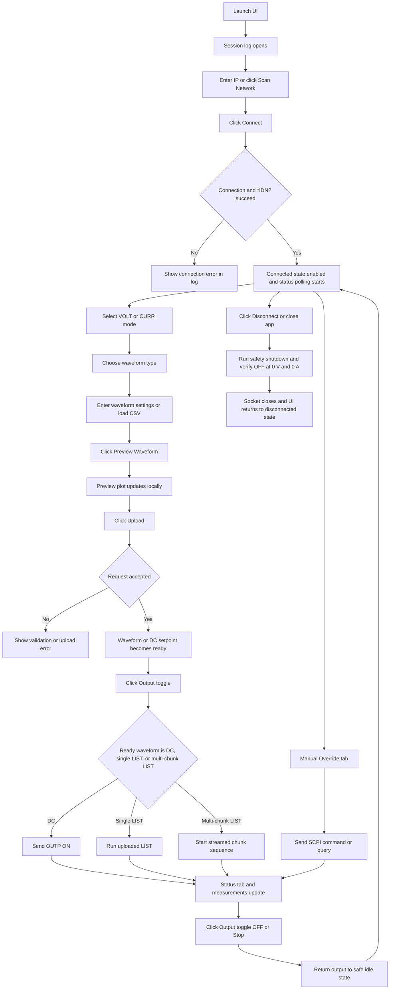
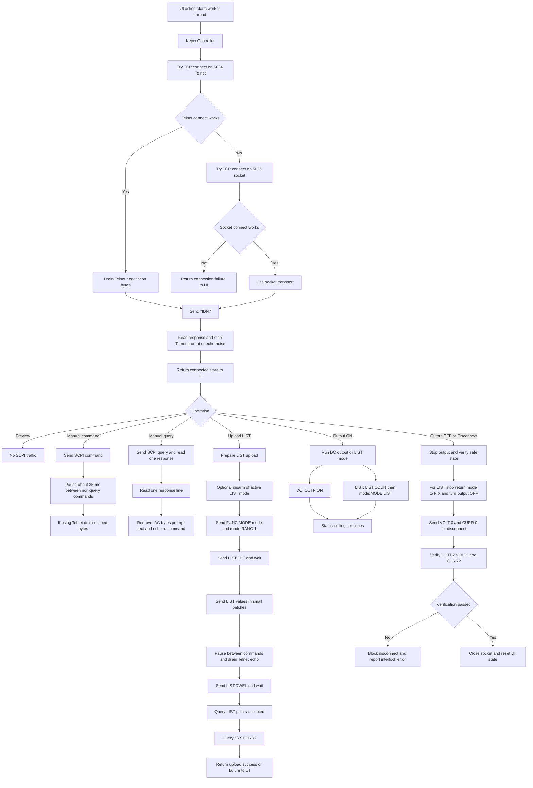

# Kepco BIT 802E Waveform Generator

Desktop GUI for generating, previewing, uploading, and controlling waveforms on a Kepco BIT 802E / BOP power supply. The app uses a hardened SCPI controller with Telnet-first communication, socket fallback, chunked LIST uploads, live status polling, and safety interlocks for disconnect and shutdown.

## Key Features

- Generate `DC`, `Sine`, `Square`, `Triangle`, `Sawtooth`, and CSV-based waveforms
- Preview waveform shape and timing before anything is sent to hardware
- Upload LIST waveforms in verified chunks that respect device limits
- Connect over Telnet on `5024` with automatic fallback to SCPI socket `5025`
- Scan local `/24` networks for devices and validate them with `*IDN?`
- Use manual SCPI controls for diagnostics, measurements, and overrides
- Persist session logs to `logs/kepco_dashboard_date_YYYY-MM-DD_HHMMSS.log`
- Develop offline with the included simulator in `kepco_simulator.py`
- Enforce safe disconnect behavior by returning output to `0 V`, `0 A`, and `OFF`

## Project Files

- `kepco_ui.py`: main CustomTkinter desktop application
- `kepco_simulator.py`: simulator that emulates Kepco Telnet and socket behavior
- `docs/interface.md`: architecture and interface notes
- `docs/802e_manual.md`: device reference material
- `requirements.txt`: Python dependencies

## Hardware Limits Implemented

- Minimum dwell: `0.0005 s`
- Maximum dwell: `10.0 s`
- Maximum points per single LIST upload: `1000`
- Maximum total staged points in the UI: `4000`
- Preferred transport: Telnet on `5024`
- Fallback transport: direct SCPI socket on `5025`

## Getting Started

1. Create and activate a virtual environment.

```powershell
python -m venv .venv
.\.venv\Scripts\Activate.ps1
pip install -r requirements.txt
```

2. Optional: run the simulator for offline testing.

```powershell
python kepco_simulator.py
```

3. Start the UI.

```powershell
python kepco_ui.py
```

4. In the app:

- Select or scan for a device IP
- Connect and confirm identity
- Choose control mode and waveform settings
- Preview the waveform locally
- Upload the waveform
- Toggle output on to run it
- Stop or disconnect when finished

## Functional UI Flow

This diagram focuses on the actual user-triggered paths in the UI.



## Telnet and SCPI Communication Flow

This diagram focuses on the controller behavior used for connect, command execution, upload, run, and disconnect.



## Runtime Behavior Summary

- `Preview` is local-only and does not send SCPI commands.
- `Upload` sends SCPI only after input validation, dwell calculation, and software interlock checks.
- Single-chunk waveforms are uploaded once and can then be armed or run.
- Multi-chunk waveforms are streamed chunk-by-chunk because the device accepts at most `1000` LIST points per upload.
- The controller spaces non-query commands by about `35 ms` to respect device throughput limits.
- On Telnet, the controller drains echoed command bytes so the device echo buffer does not block later commands.
- Status polling runs only while connected and updates output state, measurements, and the status tab.

## CSV Behavior

- CSV input accepts numeric values and flattens rows into one point list.
- The UI uses the loaded CSV values as the waveform data and computes dwell from the requested frequency.
- CSV data is truncated to the app's maximum supported total point count when necessary.
- CSV waveforms require at least `2` valid points.

## Safety and Interlocks

- The app prevents disconnect while an upload or multi-chunk stream is active.
- Before disconnect, the controller attempts the following sequence:
- Stop LIST mode
- Set `VOLT 0`
- Set `CURR 0`
- Send `OUTP OFF`
- Verify `OUTP?`, `VOLT?`, and `CURR?`
- If verification fails, disconnect is blocked and the user is shown an interlock error.

## Troubleshooting

- If connection fails, confirm the device is reachable on port `5024` or `5025`.
- If the app connects but commands appear to stall, inspect Telnet echo handling and device firmware behavior.
- If uploads fail, check waveform size, dwell constraints, and software limits in the selected control mode.
- Use `kepco_simulator.py` to reproduce connection and upload behavior without hardware.
- Review the log panel or the saved session log file for command-level details.

## Development Notes

- The SCPI controller is implemented in `KepcoController` inside `kepco_ui.py`.
- Device discovery is handled by `Discovery.scan_subnet`.
- Waveform timing and point generation live in `WaveformGen`.
- The GUI orchestration is handled by `DashboardApp`.

## Known Limitations

- The repository does not currently include automated tests.
- The GUI is desktop-only and not intended for headless control.
- CSV mode is labeled `untested` in the UI and should be validated on target hardware.

## Contributing

Use feature branches, keep safety behavior intact, and verify waveform upload behavior against the simulator or target hardware before merging.
